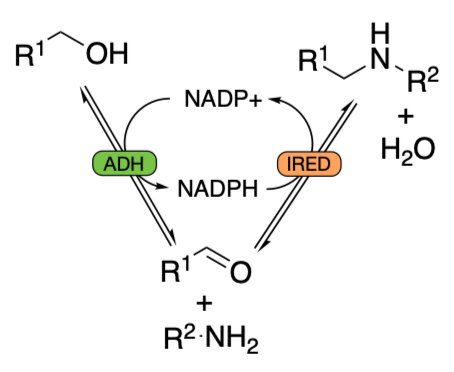
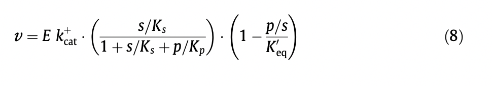
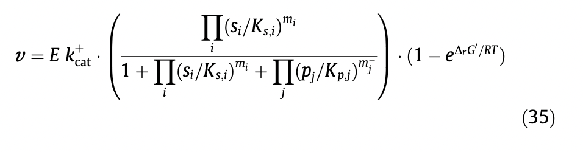

# Hydrogen Borrowing Modelling
Exploring enzyme reaction models to model hydrogen borrowing cascades

Using the kinetics package at https://github.com/willfinnigan/kinetics  
Docs at https://kinetics.readthedocs.io/en/latest/ 

The final yields of hydrogen borrowing cascades are limited by thermodynamics. 
In particular, the position of equilibrium for the IRED step is critical, 
although this can be pushed towards the product by increasing the concentration of R2-NH2. 
However, this is also fighting the 55.5 M concentration of water on the other side.  

Incorporating equilibrium constants into the enzyme reaction modelling, we can predict the progress of these reactions.  

The excellent [equilibrator](https://equilibrator.weizmann.ac.il) package is a great resource for calculating equlibrium constants.  

But then how to include the equilibrium constants into the rate equations?  
For the ADH step, we could use an equation already defined in the kinetics package - 
the reaction for a [BiBi Ordered reversible reaction with keq](https://kinetics.readthedocs.io/en/latest/_modules/kinetics/reaction_classes/equilibrium_reversible_mechaelis_menton.html#BiBi_Ordered_rev_eq).  

However, for the IRED step we need a reversible equation with three substrates and three products.  This will be quite complex.  

Alternatively, we could use the approach detailed by [E noor et al](https://doi.org/10.1016/j.febslet.2013.07.028), 
who 'decompose the reversible Michaelis–Menten equation into three terms, each with a clear physical meaning: catalytic capacity, substrate saturation and thermodynamic driving force.'  

In this paper they detail a general rate equation for multi substrate reactions.  

The use of the equation with Keq seems preferable, as I think delta_rG_prime would need to be calculated at each time point 
taking into account the changing species concentration. 

(As the system approaches equilibrium, delta_rG_prime should approach zero. 
If this is zero, the last term would also approach zero as exp(0)=1, so the rate also approaches zero).

I think either would work but using Keq is possibly simpler.  

A big assumption that is made with this approach is that 
'the enzyme can only exist in one of three distinct states: free, all substrates bound, or all products bound'.  
Whilst this assumption isn't totally accurate, it simplifies the model while hopefully still allowing it to be useful.

I've implemented the BiBi and TriTri versions of this equation into the [kinetic](https://github.com/willfinnigan/kinetics) package. 
The first model exploring if this appoach works is in [notebook 1](notebooks/model_1.ipynb)

